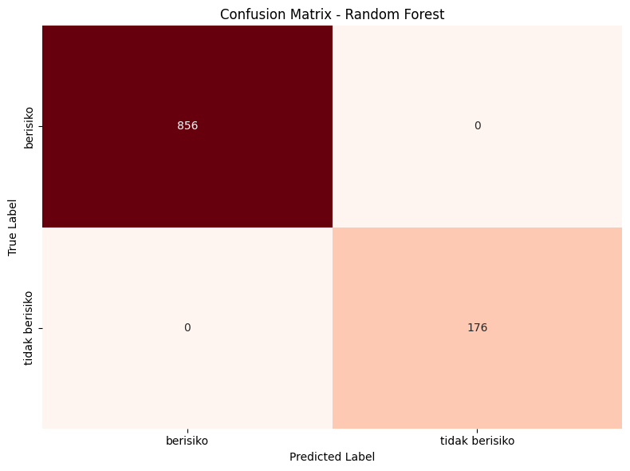
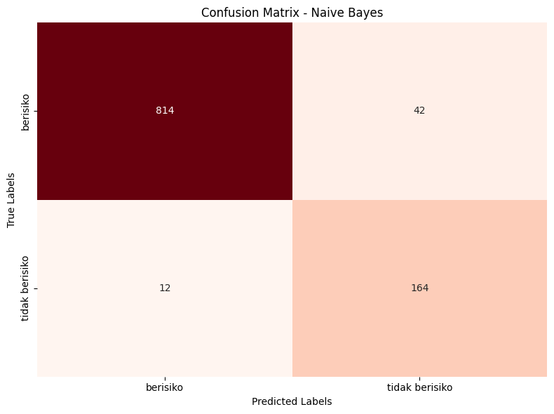
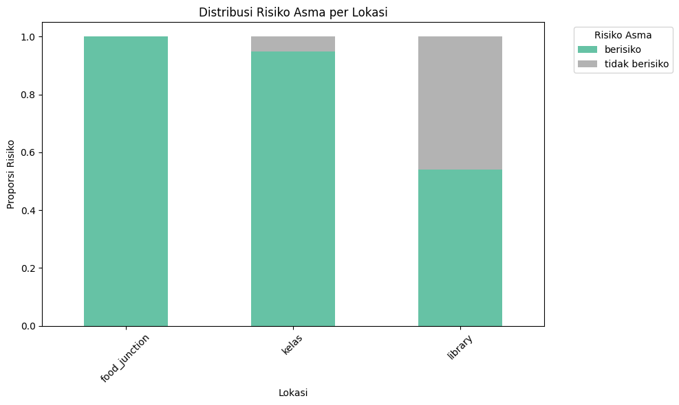
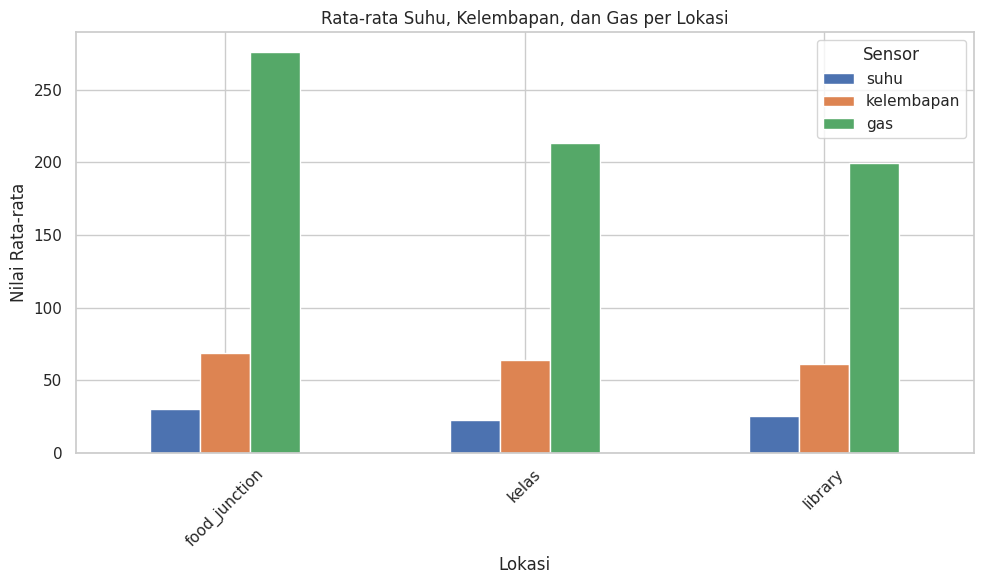

# IoT-Based Asthma Risk Monitoring Using Machine Learning

## Overview

This project integrates Internet of Things (IoT) devices and machine learning algorithms to identify locations that may trigger asthma relapse based on environmental conditions.

Environmental data including temperature, humidity, and gas concentration were collected in real time using ESP8266 microcontrollers integrated with DHT11 and MQ135 sensors across three locations at Universitas Pelita Harapan:

- Food Junction
- Classroom
- Library

The collected data were processed and classified using:

- Random Forest
- Naive Bayes

The goal of this project is to provide early environmental risk detection for asthma sufferers through real-time air quality monitoring and machine learning classification.

---

## Features

- Real-time environmental monitoring
- IoT-based sensor data collection
- MQTT communication using HiveMQ Cloud
- Cloud database integration using Supabase
- Machine learning classification
- Risk visualization and analysis
- Comparative evaluation between Random Forest and Naive Bayes

---

## System Architecture


### Data Flow

```text
ESP8266 + Sensors
        ↓
     MQTT
        ↓
    Node.js
        ↓
    Supabase
        ↓
 Google Colab ML
        ↓
 Risk Classification
```

The system uses ESP8266 microcontrollers integrated with DHT11 and MQ135 sensors to collect environmental data in real time. Data are transmitted through MQTT to a Node.js server and stored in Supabase before being analyzed using machine learning models in Google Colab.

---

## Technologies Used

### Hardware

- ESP8266
- MQ135 Gas Sensor
- DHT11 Temperature & Humidity Sensor
- LCD I2C Display

### Software

- Python
- Google Colab
- Arduino IDE
- Node.js
- Supabase
- Prisma ORM

### Machine Learning

- Random Forest
- Naive Bayes
- Scikit-learn
- Pandas
- NumPy
- Matplotlib

---

## Dataset

The dataset contains:

- Temperature
- Humidity
- Gas concentration
- Timestamp

Data were collected every 15 seconds from three campus locations at Universitas Pelita Harapan.

---

## Machine Learning Results

| Model | Accuracy |
|---|---|
| Random Forest | 1.00 |
| Naive Bayes | 0.9476 |

The Random Forest model achieved the best performance with perfect classification on the testing dataset.

---

## Visualizations

### Random Forest Confusion Matrix



### Naive Bayes Confusion Matrix



### Asthma Risk Distribution



### Average Environmental Parameters



---

## Project Highlights

- Designed an end-to-end IoT + machine learning pipeline
- Collected real-world environmental data
- Implemented cloud-based MQTT communication
- Built classification models for health-related environmental analysis
- Compared multiple machine learning algorithms
- Visualized environmental risk patterns across multiple campus locations

---

## Research Paper

[Read Full Paper](paper/paper.pdf)

---

## Google Colab Notebook

[Open in Google Colab](https://colab.research.google.com/drive/1nn4IWjsgsKUSKj4guXUkHoxM0Qmq3AD2?usp=sharing)

---

## Repository Structure

```text
iot-asthma-risk-monitoring/
│
├── README.md
├── asthma_risk_analysis.ipynb
│
├── paper/
│   └── paper.pdf
│
├── images/
│   ├── system_architecture.png
│   ├── confusion_matrix_rf.png
│   ├── confusion_matrix_nb.png
│   ├── risk_distribution.png
│   └── average_parameters.png
│
│
└── data/
    ├── food_junction.csv
    ├── kelas.csv
    └── library.csv
```

---

## Future Improvements

- Add PM2.5 and carbon monoxide sensors
- Expand monitoring locations
- Develop real-time warning notifications
- Deploy a live dashboard for monitoring
- Improve model robustness with larger datasets

---

## Authors

- Gebrina Augustine Padatu
- Grace Patricia Ananta
- Jennifer Christabelle

Universitas Pelita Harapan